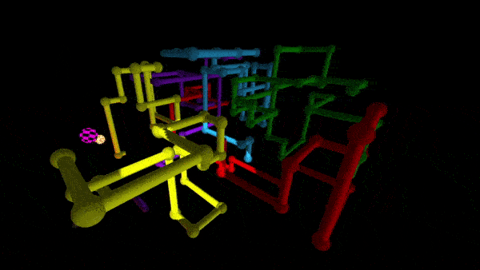

# README

* Final (The Internet is a Series of Tubes)
* CS 464
* December 13, 2023
* Team 8 (Mesa Greear & Joshua Thomas)

## INCLUDED FILES:

 * final.html
 * ./src/drawing.js
 * ./src/geometry.js
 * ./src/misc.js
 * ./src/user.js
 * ./src/misc/glMatrix_util.js
 * ./src/misc/lights.js
 * ./src/misc/matrixStack.js
 * ./src/misc/misc_util.js
 * ./src/misc/pipe.js
 * ./src/misc/shape.js
 * ./src/misc/webgl-utils.js
 * ./src/misc/style.css
 * ./shaders/default.frag
 * ./shaders/default.vert
 * ./icons/*.png
 * ./textures/*.png
 * ./exampleImgs/*.gif
 * manual.md
 * README.md

## OVERVIEW:

### Geometry

 In our geometry code, only 3 types of shapes can be created. A square (which is never used because we didn't add in the normals), a sphere, and a cylinder. A
 sphere and cylinder can be initialized with different parameters such as radius and quality and then stored as a custom datatype we created called Shape which
 simply stores the vertex, normal, texture, and index buffers of the shape. When the shape is drawn in our scene, the buffer information is gathered from the
 Shape object.

 To generate the coordinates a pipe will draw in as well as perform other operations necessary to generate an infinitely and randomly moving pipe, a datatype
 called Pipe was created. There's a lot going on in Pipe and I won't get into it all here, but the main feature of a Pipe object is it's queue where new segments
 of the pipe are added to the head and old segments are removed from the bottom once the queue has reached a user determined length. Each index in the queue
 contains information about what shape to draw, it's coordinates, and the direction/axis this segment is moving along. The Pipe object has several methods which
 are used to handle adding new segments and determining how long a pipe section will be.

### Drawing

 When drawing shapes to our scene, a Matrix Stack is used which made drawing shapes at the correct coordinates much easier to accomplish. It also allowed us to
 easily alter how we look at our scene via manually defining angles to rotate the scene by or setting the top of the stack to a lookAt matrix.

 Our actual draw function is fairly simple, taking in a Shape object, texture, projection matrix, and bool representing if the shape should be effected by light.
 The draw function then sets the mvMatrix based on the top of the Matrix Stack, binds the buffers contained in the passed in Shape object, and then draws the
 elements.

### Lighting

We implemented the four basic types of scene lights: ambient light,
directional light, spotlight, and point light. For simplicity, we have
defined a custom data type for each type of light. Each light's data type
holds the data necessary for that light's calculations, as well as a 
method that binds that data to the appropriate shader uniforms. 

All light calculations are done per-vertex in the vertex shader, and an 
appropriate light weighting is calculated for each light type and then 
passed to the fragment shader in a corresponding `varying` variable. 
The different light weighting values are then combined in the fragment 
shader. We intentionally do *not* clamp total light intensity to 1.0. 
This was a stylistic choice to allow for "blown-out" lighting when
multiple light types combine, contributing to an overall sense of light 
intensity in the scene. Additionally, the fragment shader uses some 
boolean uniforms to easily enable or disable each type of light based 
on user controls.

Once the total light weighting for a vertex is calculated, this is
multiplied by the color of the texture at that vertex, which we sample 
using vertex attributes supplied in the draw call. Since we use mostly
single-color textures, this has some interesting effects when changing
the color of the light sources. It mirrors the light reflective properties
of objects in reality. For example, a blue object under purely red light
will appear black, and objects in our scene demonstrate the same property.

When drawing the "debug" objects for point light and spotlight, we do not
do any lighting multiplication and instead just sample from a texture. This
makes these objects stand out better even in a complicated scene with many
lengthy pipes.

#### Ambient and Directional Light

Ambient light is purely color information, while the directional light has both
color and direction. The dot product of the vertex normal with the light direction
tells us the cosine of the angle between the two vectors, which we use to
determine the amount of directional lighting that a vertex receives. These
two light types work together, weighted so that ambient light contributes 20% of light intensity and directional light is 80%. This scaling occurs in the
fragment shader when we are calculating the final color for a pixel. 

#### Point Light

Point lights contain three pieces of information: color, position, and 
falloff distance. In the vertex shader, we take the vertex's position and the
point light's position and compute the distance vector between them. Similar to
directional lighting, we take the dot product of the vertex normal and this
distance vector to determine the amount of light the vertex should receive. We
then take the length of this distance vector and feed it into a `smoothstep` GLSL
built-in function between 0 and our falloff distance uniform value. This has
the effect of making the light dimmer as a vertex gets farther away from the
point light, with vertices beyond the falloff distance receiving no light. 
We use `smoothstep` because it scales the light intensity *non*-linearly with
distance, which is more realistic and also just plain looks good.

#### Spot Light

The spotlight is similar in concept to a point light, but it has its own
constant direction vector rather than using the distance vector between the
light and a vertex. The provided UI allows a user to adjust the pitch and yaw 
angles of the spotlight's direction. Before the draw call, these Euler angles are 
used to calculate a directional unit vector that is finally sent to the shader. 
After finding the angle between the spotlight direction vector and the vertex 
normal, we check that this angle is within the spotlight's angle of effect (which 
is equal to half the angle spanned by its light cone). If the angle between the
direction and the normal are outside this range, then the vertex receives no
light from the spotlight, resulting in a harsh circular cutoff at the edges of
the light cone. We do not do any smooth falloff at the light cone's edges or at
any distance from the point light. This was also an artistic decision, meant to
make the spotlight feel very intense and strongly directed, like the searchlight
on an emergency rescue helicopter for example.

### Shaders

The shaders do the standard transformations of vertices using model, view, and 
projection matrices computed prior to the draw call. We also multiply our normals
by these matrices in order to achieve smooth lighting even when objects have a
relatively small number of vertices. After these steps, we implement the lighting 
as described for each light type above. 

Shader initialization code was modified to load shader programs from separate files 
rather than requiring shaders be written directly in an HTML `<script>` tag. This 
was done with the intent of supporting multiple shaders later on, which would be 
useful for a variety of lighting effects such as shadow mapping, skyboxes, or 
distance fog. We did not end up actually implementing any features that used this 
functionality. However, it was still nice to have the shaders written in separate 
files so that we could have syntax highlighting and code completion for GLSL in our 
IDE during development.

## Sources

- [HTML Checkbox](https://www.w3schools.com/howto/howto_css_switch.asp)
- [Sphere Geometry Code](https://stackoverflow.com/questions/47756053/webgl-try-draw-sphere)
- [Cylinder Geometry Code](https://www.songho.ca/opengl/gl_cylinder.html#cylinder)
- [Point Lighting](https://webglfundamentals.org/webgl/lessons/webgl-3d-lighting-point.html)
- [Spotlight](https://webglfundamentals.org/webgl/lessons/webgl-3d-lighting-spot.html)
- [Orthographic Projection](https://glmatrix.net/docs/module-mat4.html)
- [various concepts](https://youtube.com/playlist?list=PLPbmjY2NVO_X1U1JzLxLDdRn4NmtxyQQo&si=re3avJ6YJgiFttQk) (used for reference only, no code taken)